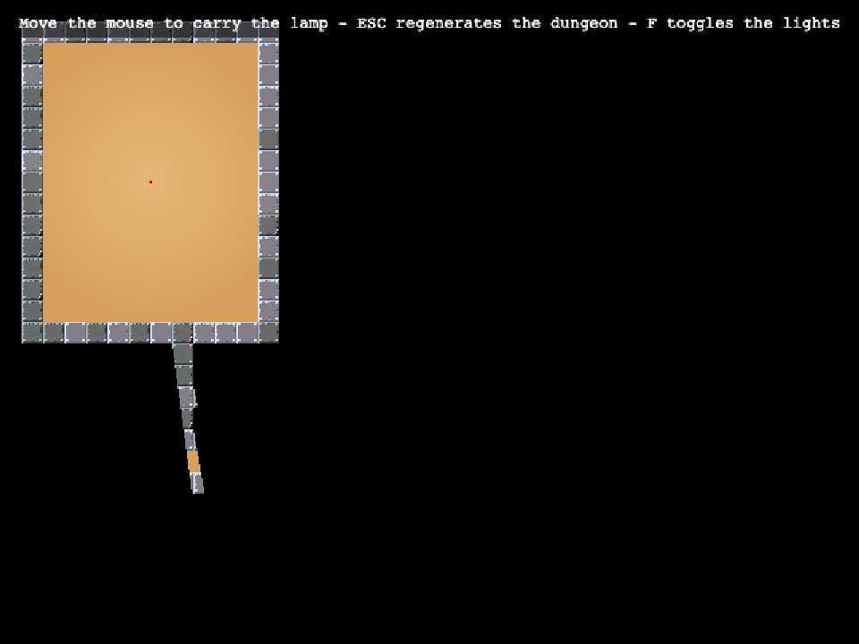

# Phaser Lighting Demo

A Phaser 4 + TypeScript port of [joffcom/lighting-demo](https://github.com/joffcom/lighting-demo), a HaxeFlixel proof-of-concept for procedural dungeons with 2D shadow-casting lighting. Move the mouse to carry a lamp through a BSP-generated dungeon; press `ESC` to regenerate it.

What was ported:

- **Dungeon generation** ([src/game/dungeon](src/game/dungeon)) - the original's binary-space-partition Leaf/room/hallway algorithm, carving a floor/wall grid instead of a HaxeFlixel `BitmapData`.
- **Visibility / shadow casting** ([src/game/lighting/Visibility.ts](src/game/lighting/Visibility.ts)) - based on the [Red Blob Games](http://www.redblobgames.com/articles/visibility/) 2D visibility sweep the original used, ported to TypeScript and reworked from there. The original's `polygonal-ds` doubly-linked list isn't needed here - the algorithm only ever scans its "open segments" list from the front and splices in/out by value, which a plain JS array does just as well.
- **Lighting** ([src/game/scenes/Game.ts](src/game/scenes/Game.ts)) - an opaque `RenderTexture` darkness overlay, erased each frame with the visibility polygon itself (a `Graphics` shape, not a masked sprite - Phaser 4 dropped `GeometryMask` support under WebGL, per its own source comments), giving pixel-exact wall occlusion. A soft warm glow sits underneath at all times; the opaque darkness is what actually keeps it - and everything else - hidden outside line of sight. The lamp also only follows the mouse across floor tiles, since the dungeon's unbuilt "background" is solid rock, not open air. Press `F` to toggle the darkness off and reveal the whole generated dungeon.

Built on the official [Phaser 4 + Vite + TypeScript template](https://github.com/phaserjs/template-vite-ts), which is where the build tooling below comes from - hot-reloading dev server, TypeScript support, and production-build scripts.

### Versions

Built with:

- [Phaser 4](https://github.com/phaserjs/phaser)
- [Vite 6.3.1](https://github.com/vitejs/vite)
- [TypeScript 5.7.2](https://github.com/microsoft/TypeScript)



## Requirements

[Node.js](https://nodejs.org) is required to install dependencies and run scripts via `npm`.

## Available Commands

| Command | Description |
|---------|-------------|
| `npm install` | Install project dependencies |
| `npm run dev` | Launch a development web server |
| `npm run build` | Create a production build in the `dist` folder |

## Writing Code

Clone [the repo](https://github.com/Joffcom/phaser-lighting-demo), then run `npm install` from the project directory. Start the local development server with `npm run dev`.

The local development server runs on `http://localhost:8080` by default. Please see the Vite documentation if you wish to change this, or add SSL support.

Once the server is running you can edit any of the files in the `src` folder. Vite will automatically recompile your code and then reload the browser.

## Project Structure

| Path                                   | Description                                                        |
|-----------------------------------------|--------------------------------------------------------------------|
| `index.html`                           | A basic HTML page to contain the game.                             |
| `public/assets`                        | Game sprites (tileset, lamp glow). Served directly at runtime.     |
| `public/style.css`                     | Global layout styles.                                              |
| `src/main.ts`                          | Application bootstrap.                                             |
| `src/game/main.ts`                     | Game entry point: configures and starts the game.                  |
| `src/game/scenes/Game.ts`              | The one scene: builds the dungeon and drives the lighting each frame. |
| `src/game/dungeon/Leaf.ts`             | BSP leaf/room/hallway generation.                                  |
| `src/game/dungeon/generate.ts`         | Turns a BSP tree into a floor/wall grid, wall segments and tile indices. |
| `src/game/lighting/Visibility.ts`      | The Red Blob Games 2D visibility sweep, ported to TypeScript.      |


## Handling Assets

This template supports both embedding assets (via a JS `import`) and loading them from the static `public/assets` folder, which is what this project uses - see [Game.ts](src/game/scenes/Game.ts):

```ts
preload() {
    this.load.setPath('assets');
    this.load.image('tileset', 'tileset.png');
    this.load.image('light', 'light.png');
}
```

When you issue the `npm run build` command, all static assets are automatically copied to the `dist/assets` folder.

## Deploying to Production

After you run the `npm run build` command, your code will be built into a single bundle and saved to the `dist` folder, along with any other assets your project imported, or stored in the public assets folder.

In order to deploy your game, you will need to upload *all* of the contents of the `dist` folder to a public facing web server.

This project's build tooling is from Phaser Studio's official Vite + TypeScript template. The Phaser logo and characters are &copy; 2011 - 2025 Phaser Studio Inc.
